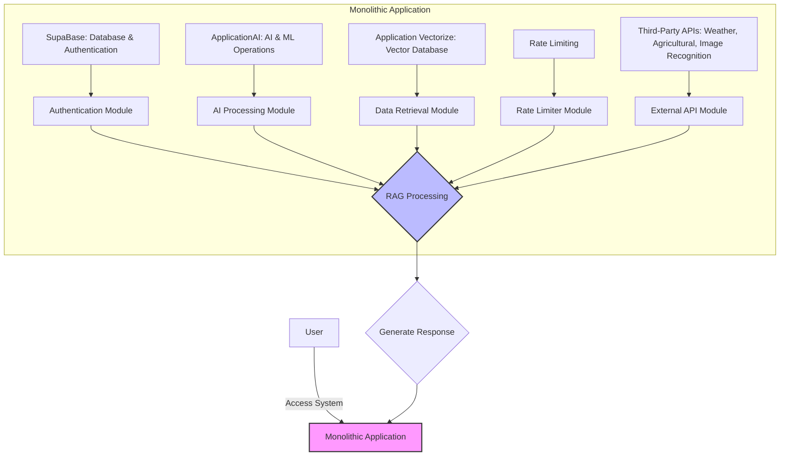
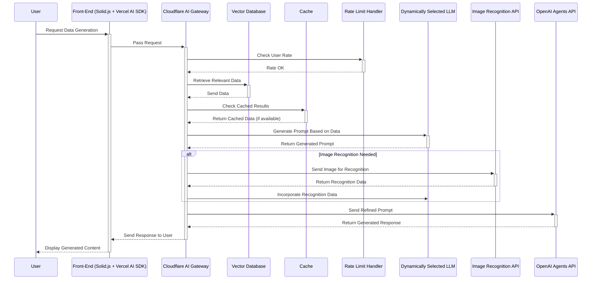
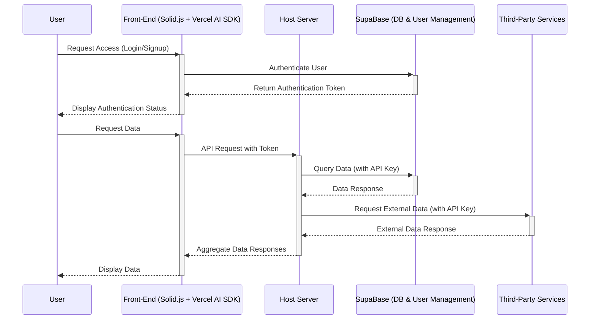
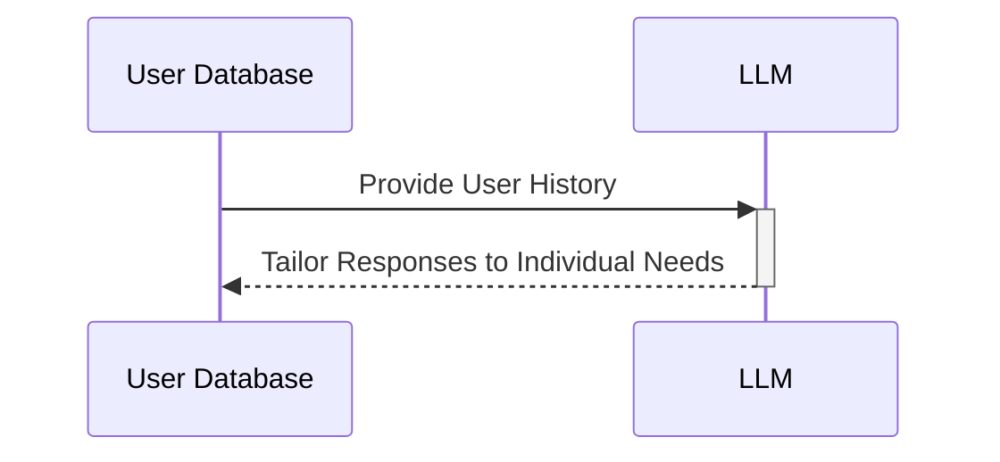

# Diagrams

This document contains diagrams that illustrate the architecture of the project.

## Diagram 1: VerdantVirtuoso Architecture



### Explanation of the Diagram

- `User Interaction`: Users access the system through a unified interface that routes requests into the monolithic application.
- `Monolithic Application Components`:
  - `Authentication Module`: Manages user authentication and security, leveraging SupaBase's capabilities.
  - `AI Processing Module`: Processes requests using CloudFlareAI, which handles AI and machine learning operations.
  - `Data Retrieval Module`: Retrieves and manages data using Cloudflare Vectorize, a vector database for handling complex queries.
  - `Rate Limiter Module`: Ensures the system adheres to set thresholds for request rates, preventing abuse and overloading.
  - `External API Module`: Handles communication with third-party APIs, including those for weather data, agricultural insights, and image recognition.
  - `RAG Processing`: The Retrieval Augmented Generation core processes the information from all modules to generate responses tailored to user requests. This includes integrating AI outputs, database queries, and external data into coherent advice or information for the user.
- `Generate Response`: The final processed outputs are compiled into responses that are sent back to the user, completing the cycle.

## Diagram 2: VerdantVirtuoso Data Flow - RAG Workflow



### Explanation of the Workflow

- User Request: The user initiates a data generation request from the Front-End, which passes through application.
- Rate Limiting: The request is first checked against the rate limit handler to ensure compliance with usage policies.
- Data Retrieval: Concurrently, the vector database retrieves relevant data, and the cache is checked for any pre-existing results to speed up the response.
- LLM Interaction: The dynamically selected LLM generates a prompt based on the retrieved and potentially cached data.
- Optional Image Recognition: If the workflow requires image data, the image recognition API processes any provided images and the results are incorporated into the LLM's data.
- OpenAI Agents API: The refined prompt is sent to the OpenAI Agents API for final generation, and the response is then relayed back to the user.

## Diagram 3: VerdantVirtuoso Data Flow - User Interaction



### Explanation of the Interaction

- Authentication: The user initiates a login/signup request, handled by SupaBase through the Front-End, which returns an authentication token.
- Data Request and Response: User requests data. It authenticates with SupaBase and third-party services using securely stored API keys, gathers the data, and returns it via the Front-End to the user.

## Diagram Section Enhancements

Given the specific context of aiding gardeners and farmers with a specialized AI agent, VerdantVirtuoso, listed here are some enhancement goals and additional components that could be integrated into our Retrieval Augmented Generation (RAG) workflow to make it more effective and tailored to the needs of this audience:

1. Specialized Agricultural Data Sources
   - Incorporate access to specialized databases that contain agricultural research, weather patterns, pest control methodologies, and plant disease databases. This would allow the LLM to pull contextually relevant data to provide more accurate and useful responses.

    ```mermaid
    sequenceDiagram
        participant Application as Host Server
        participant AgriDB as Agricultural Database
        Application->>+AgriDB: Retrieve Agricultural Data
        AgriDB-->>-Application: Return Specific Info
    ```

2. Seasonal and Geo-Specific Adjustments
   - Adjust recommendations based on the season and geographic location of the user. This could involve integrating geographical APIs that help identify local climate conditions, soil types, and suitable plant varieties.

    ```mermaid
    sequenceDiagram
        participant LLM as LLM
        participant GeoAPI as Geographical API
        LLM->>+GeoAPI: Query Local Conditions
        GeoAPI-->>-LLM: Return Geo-Specific Data
    ```

3. Real-Time Weather Integration
   - Incorporate real-time weather data to provide timely advice, such as when to plant, water, or protect plants from impending adverse weather conditions. This can significantly impact the advice given to gardeners and farmers.

    ```mermaid
    sequenceDiagram
        participant Application as Host Server
        participant WeatherAPI as Weather API
        Application->>+WeatherAPI: Request Weather Data
        WeatherAPI-->>-Application: Return Weather Forecast
    ```

4. Community-Driven Insights
   - Enable the system to learn from a community of users by integrating user-generated content, feedback, and shared experiences. This could help in evolving the system’s responses and increasing accuracy over time.

    ```mermaid
    sequenceDiagram
        participant VectorDB as Vector Database
        participant Community as Community Feedback
        VectorDB->>+Community: Integrate User Feedback
        Community-->>-VectorDB: Update Data Models
    ```

5. Image Analysis for Disease and Pest Detection
   - Enhance the image recognition capabilities to identify specific pests and diseases from images uploaded by users. This can provide immediate diagnostic support and suggestions for management practices.

    ```mermaid
    sequenceDiagram
        participant ImageAPI as Enhanced Image Recognition API
        ImageAPI->>+Application: Analyze for Pests/Diseases
        Application-->>-ImageAPI: Provide Diagnosis and Solutions
    ```

6. Advanced Prediction Models
   - Use machine learning models to predict future issues based on historical data and trends. This could include predicting pest invasions, disease outbreaks, or optimal planting times.

    ```mermaid
    sequenceDiagram
        participant LLM as LLM
        participant MLModel as Machine Learning Model
        LLM->>+MLModel: Predict Future Agricultural Trends
        MLModel-->>-LLM: Provide Predictive Insights
    ```

7. Personalized User Profiles
   - Develop more detailed user profiles that keep track of individual gardening or farming histories, preferences, and past advice efficacy. This personalization can enhance the relevancy and impact of the advice given.
   - Integrate real-time data tracking to monitor plant growth, soil conditions, and other relevant metrics to provide tailored recommendations.



### Summary

These enhancements focus on integrating specific agricultural knowledge, leveraging real-time environmental data, incorporating user feedback, and applying advanced image recognition and machine learning technologies. This approach would not only increase the functional depth of VerdantVirtuoso but also its practical value to end-users in the agricultural sector.
